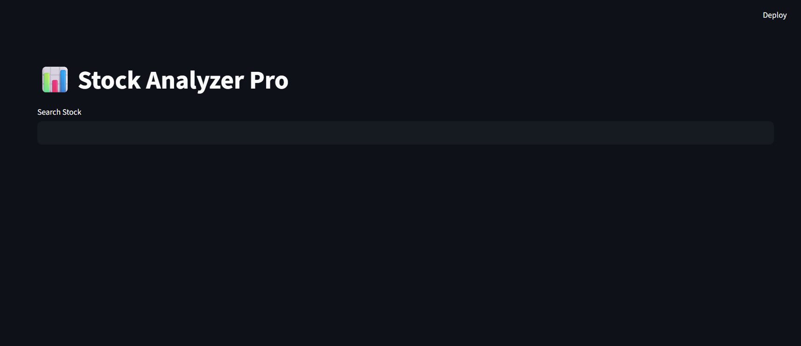
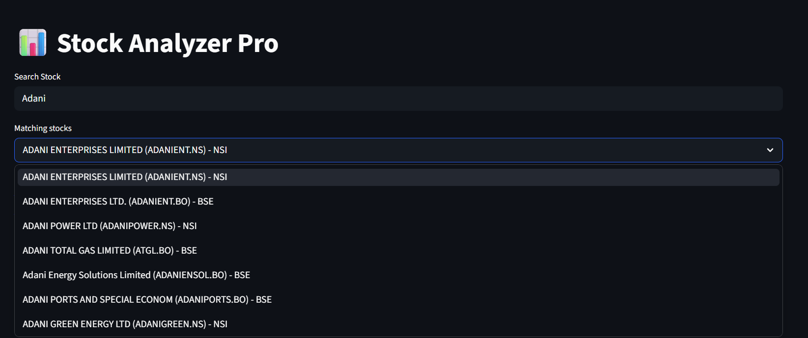
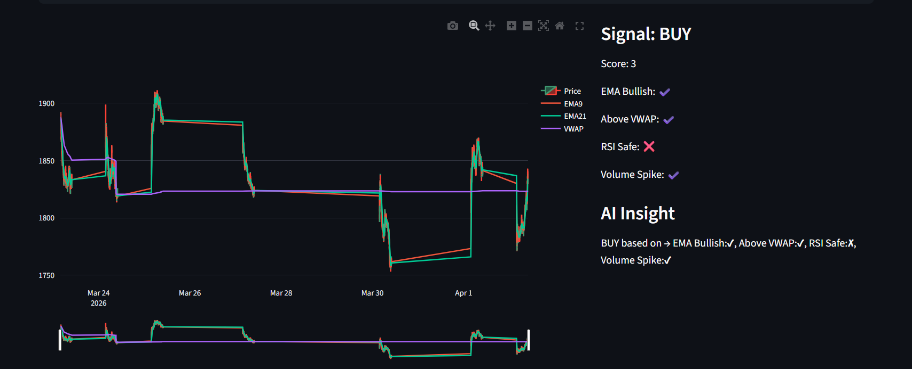
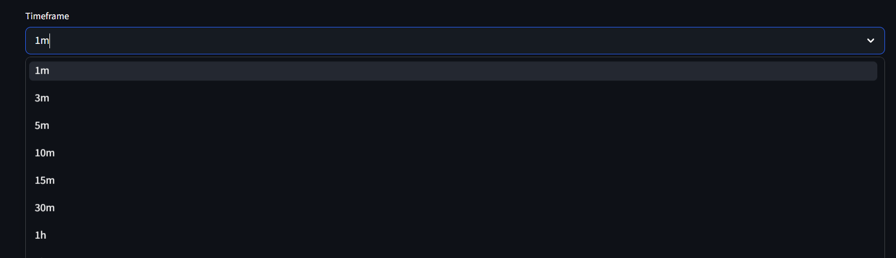

# Stock Analyzer Pro

A Zerodha-style stock analysis and paper trading app.

## Features
- Smart stock search with ticker and company-name matching
- Technical indicators (RSI, EMA, VWAP)
- BUY/SELL signals
- Multiple chart timeframes from intraday to monthly
- Paper trading with risk management
- Trade dashboard (PnL, Win Rate, Equity Curve)

## Screenshots

### Homepage


### Search And Match Suggestions


### Analysis Dashboard


### Timeframe Selection


## Run locally
```bash
pip install -r requirements.txt
streamlit run app.py
